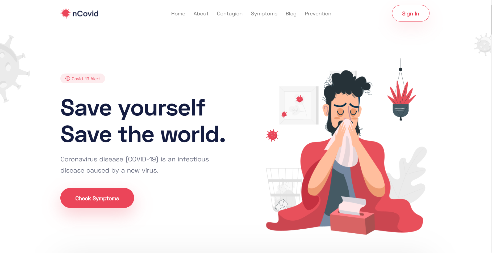

# Covid19-Azure 

 

__Lets Break the Chain__ :smile: 

__Download Apk from here__ [Covid.co](app-debug.apk)

 

 

 

The COVID-19 pandemic, also known as the coronavirus pandemic, is an ongoing pandemic of coronavirus disease 2019 (COVID‑19), caused by severe acute respiratory syndrome coronavirus 2 (SARS‑CoV‑2).The outbreak was first identified in Wuhan, China, in December 2019. The World Health Organization declared the outbreak a Public Health Emergency of International Concern on 30 January, and a pandemic on 11 March. As of 20 May 2020, more than 4.96 million cases of COVID-19 have been reported in more than 188 countries and territories, resulting in more than 326,000 deaths. More than 1.88 million people have recovered from the virus. 

 __Screenshots__
 
 
 
 
 
 
 
